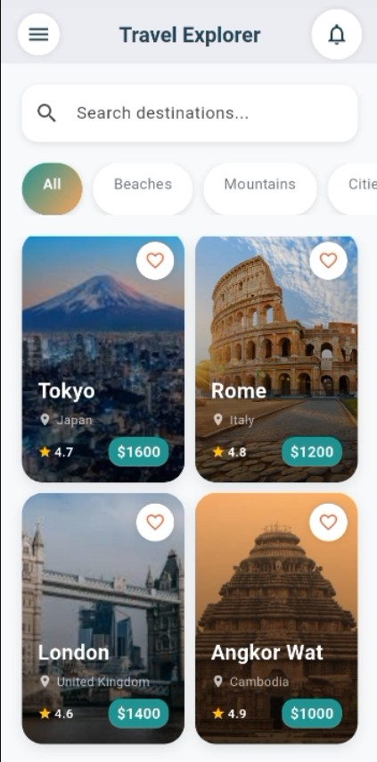
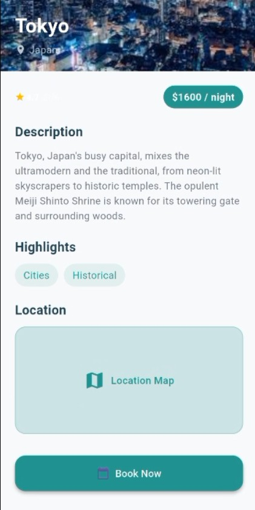
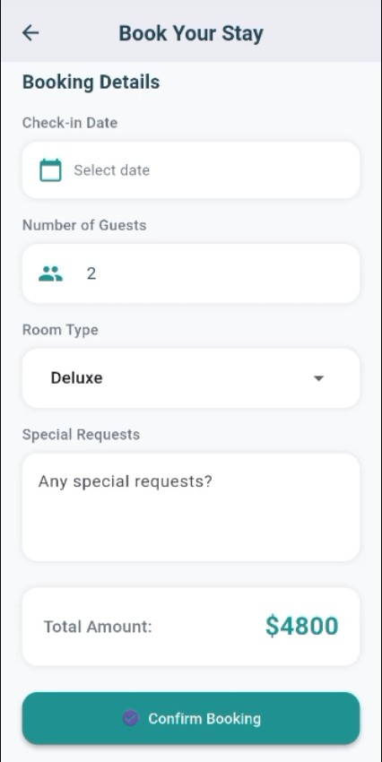

# ✈️ Travel Explorer - Flutter UI Challenge

<div align="center">
  
  <h3>A Multi-Screen Travel Application UI Built with Flutter</h3>
  <p>Advanced UI Design | Hard-coded Data | Multi-screen Navigation</p>
  
  <div>
    
    
    
    
  </div>
</div>

<div align="center">
  <h2>📱 App Demo Video</h2>
  
  <video width="600" controls style="border-radius: 20px; box-shadow: 0 10px 30px rgba(0,0,0,0.3);">
    <source src="screenshots/travel_explorer_app_demo.mp4" type="video/mp4">
    Your browser does not support the video tag. 
    <a href="screenshots/travel_explorer_app_demo.mp4">Download the demo video</a>
  </video>
  
  <p>
    <strong>▶️ Watch the full app walkthrough above</strong>
  </p>
  <p>
    <em>Shows: Home Screen → Detail Screen → Booking Screen → Navigation Flow</em>
  </p>
</div>

## 📱 Project Overview

Travel Explorer is a sophisticated mobile application UI built with Flutter that demonstrates advanced layout techniques, multi-screen navigation, and custom widget composition. This project focuses on creating a visually appealing travel booking interface with completely hard-coded data - perfect for learning complex UI patterns without backend dependencies.

### ✨ Key Features

- **Complex Dashboard**: Multi-section home screen with search bar, category filters, and destination grids
- **Detail Views**: Comprehensive destination information with scrollable content
- **Booking Flow**: Multi-step booking process with form validation
- **Navigation**: Seamless screen-to-screen data passing
- **Custom Widgets**: 5+ reusable widget components
- **Responsive Design**: Adapts to different screen sizes
- **20+ Flutter Widgets**: Demonstrates extensive widget composition

## 🎯 Learning Objectives Achieved

- ✅ Advanced UI design patterns in Flutter
- ✅ Complex layout composition (Stack, GridView, ListView)
- ✅ Multi-screen navigation with data passing
- ✅ Custom widget creation and reuse
- ✅ State management with setState
- ✅ Hard-coded data architecture
- ✅ Form handling and validation
- ✅ Gradient and shadow effects
- ✅ Responsive spacing techniques

## 🏗️ Architecture
```bash
lib/
├── main.dart # App entry point
├── models/
│ └── destination.dart # Data model
├── data/
│ └── travel_data.dart # Hard-coded destinations
├── screens/
│ ├── home_screen.dart # Main dashboard
│ ├── detail_screen.dart # Destination details
│ └── booking_screen.dart # Booking form
├── widgets/
│ ├── destination_card.dart # Reusable card
│ ├── category_chip.dart # Filter chips
│ ├── rating_widget.dart # Star ratings
│ └── custom_button.dart # Styled buttons
├── themes/
│ └── app_theme.dart # Color scheme
└── constants/
└── app_constants.dart # App constants

```

## 📸 Screenshots

<div align="center">
  <table>
    <tr>
      <td></td>
      <td></td>
      <td></td>
    </tr>
    <tr>
      <td align="center"><b>Home Screen</b></td>
      <td align="center"><b>Detail Screen</b></td>
      <td align="center"><b>Booking Screen</b></td>
    </tr>
  </table>
</div>

## 🚀 Getting Started

### Prerequisites

- Flutter SDK (3.0.0 or higher)
- Dart SDK (3.0.0 or higher)
- Android Studio / VS Code
- Git

### Installation

1. **Clone the repository**
   ```bash
   git clone https://github.com/yourusername/travel_app.git
   cd travel_app
   ```
Install dependencies

```bash
flutter pub get
Run the app
```
```bash
flutter run
```
Build for Production

# Android APK
```bash
flutter build apk --release
```
# iOS IPA
```bash
flutter build ios --release
```

🎨 UI Components
Widgets Used (20+)
Widget Category	Widgets
Layout	Scaffold, Container, Column, Row, Stack, Expanded, Padding, SizedBox
Navigation	AppBar, BottomNavigationBar, Navigator
Lists	ListView.builder, GridView.builder, SingleChildScrollView
Styling	DecoratedBox, ClipRRect, Positioned, Opacity
Input	TextField, Form, TextFormField, DropdownButtonFormField
Feedback	AlertDialog, SnackBar, CircularProgressIndicator
Media	Image.asset, Icon, IconButton
Custom Reusable Widgets
DestinationCard - Complex card with image overlay and gradient

CategoryChip - Filter chip with selection state

RatingWidget - Star rating display with review count

CustomButton - Styled button with icon support

SearchBar - Animated search input

📱 Screen Specifications
1. Home Screen
AppBar: Custom styled with circular icons

Search Bar: UI-only implementation with shadow

Categories: Horizontal scrollable chips with gradient on select

Popular Section: Horizontal list with fixed width

Recommended: 2-column responsive grid

2. Detail Screen
Header: Full-width image with gradient overlay

Info Section: Rating, price, description

Highlights: Dynamic category tags

Location: Map placeholder

Booking CTA: Prominent book button

3. Booking Screen
Summary Card: Gradient background with destination preview

Form Fields: Date picker, guest counter, room selector

Total Price: Calculated display

Confirmation: AlertDialog with success message

🔄 Navigation Flow
text
┌─────────────┐     ┌─────────────┐     ┌─────────────┐
│   Home      │────▶│   Detail    │────▶│   Booking   │
│   Screen    │     │   Screen    │     │   Screen    │
└─────────────┘     └─────────────┘     └──────┬──────┘
       ▲                                        │
       │                                        │
       └────────────────────────────────────────┘
                    Back Navigation
💾 Data Structure
All data is hard-coded in travel_data.dart:

dart
Destination {
  String id
  String name
  String location
  String description
  double price
  double rating
  int reviews
  String imageUrl
  List<String> categories
  bool isPopular
}
🎨 Color Palette
Color	Name	Hex Code	Usage
🟢	Primary	#2A9D8F	Buttons, active states
🟠	Secondary	#E76F51	Accents, favorite icon
🟡	Accent	#F4A261	Gradients, highlights
⚪	Background	#F8F9FA	Screen background
🔵	Text Primary	#264653	Main text
🔘	Text Secondary	#6C757D	Subtext
🛠️ Performance Optimizations
✅ itemExtent in ListView for fixed-size items

✅ Cached expensive method calls

✅ Extracted reusable widgets

✅ const constructors where possible

✅ shrinkWrap: true for nested grids

📋 Assignment Requirements Checklist
Multi-screen navigation (Home → Detail → Booking)

Hard-coded data in separate Dart file

Complex layouts with Stack, Positioned

GridView and ListView implementations

Custom reusable widgets

Gradient and shadow effects

20+ Flutter widgets used

Form layout with validation

Success dialog on confirmation

Consistent theme and spacing

🤝 Contributing
This is a student project for educational purposes. Feel free to fork and enhance!

📄 License
This project is created for educational purposes as part of a Flutter UI design lab.

👨‍💻 Author
Your Name

GitHub: @yourusername

LinkedIn: Your Profile

🙏 Acknowledgments
Flutter Documentation

Material Design Guidelines

Travel app design inspiration
```bash

lib/
├── main.dart # App entry point
├── models/
│ └── destination.dart # Data model
├── data/
│ └── travel_data.dart # Hard-coded destinations
├── screens/
│ ├── home_screen.dart # Main dashboard
│ ├── detail_screen.dart # Destination details
│ └── booking_screen.dart # Booking form
├── widgets/
│ ├── destination_card.dart # Reusable card
│ ├── category_chip.dart # Filter chips
│ ├── rating_widget.dart # Star ratings
│ └── custom_button.dart # Styled buttons
├── themes/
│ └── app_theme.dart # Color scheme
└── constants/
└── app_constants.dart # App constants

```

## 📸 Screenshots

<div align="center">
  <table>
    <tr>
      <td></td>
      <td></td>
      <td></td>
    </tr>
    <tr>
      <td align="center"><b>Home Screen</b></td>
      <td align="center"><b>Detail Screen</b></td>
      <td align="center"><b>Booking Screen</b></td>
    </tr>
  </table>
</div>

## 🚀 Getting Started

### Prerequisites

- Flutter SDK (3.0.0 or higher)
- Dart SDK (3.0.0 or higher)
- Android Studio / VS Code
- Git

### Installation

1. **Clone the repository**
   ```bash
   git clone https://github.com/yourusername/travel_app.git
   cd travel_app
```

2. **Install dependencies**

   ```
   flutter pub get
   ```
3. **Run the app**
   **bash**

   ```
   flutter run
   ```

### Build for Production

**bash**

```
# Android APK
```bash
flutter build apk --release
```
# iOS IPA
```bash
flutter build ios --release
```

## 🎨 UI Components

### Widgets Used (20+)

| Widget Category      | Widgets                                                              |
| -------------------- | -------------------------------------------------------------------- |
| **Layout**     | Scaffold, Container, Column, Row, Stack, Expanded, Padding, SizedBox |
| **Navigation** | AppBar, BottomNavigationBar, Navigator                               |
| **Lists**      | ListView.builder, GridView.builder, SingleChildScrollView            |
| **Styling**    | DecoratedBox, ClipRRect, Positioned, Opacity                         |
| **Input**      | TextField, Form, TextFormField, DropdownButtonFormField              |
| **Feedback**   | AlertDialog, SnackBar, CircularProgressIndicator                     |
| **Media**      | Image.asset, Icon, IconButton                                        |

### Custom Reusable Widgets

1. **DestinationCard** - Complex card with image overlay and gradient
2. **CategoryChip** - Filter chip with selection state
3. **RatingWidget** - Star rating display with review count
4. **CustomButton** - Styled button with icon support
5. **SearchBar** - Animated search input

## 📱 Screen Specifications

### 1. Home Screen

* **AppBar** : Custom styled with circular icons
* **Search Bar** : UI-only implementation with shadow
* **Categories** : Horizontal scrollable chips with gradient on select
* **Popular Section** : Horizontal list with fixed width
* **Recommended** : 2-column responsive grid

### 2. Detail Screen

* **Header** : Full-width image with gradient overlay
* **Info Section** : Rating, price, description
* **Highlights** : Dynamic category tags
* **Location** : Map placeholder
* **Booking CTA** : Prominent book button

### 3. Booking Screen

* **Summary Card** : Gradient background with destination preview
* **Form Fields** : Date picker, guest counter, room selector
* **Total Price** : Calculated display
* **Confirmation** : AlertDialog with success message

## 🔄 Navigation Flow

**text**

```
┌─────────────┐     ┌─────────────┐     ┌─────────────┐
│   Home      │────▶│   Detail    │────▶│   Booking   │
│   Screen    │     │   Screen    │     │   Screen    │
└─────────────┘     └─────────────┘     └──────┬──────┘
       ▲                                        │
       │                                        │
       └────────────────────────────────────────┘
                    Back Navigation
```

## 💾 Data Structure

All data is hard-coded in `travel_data.dart`:

**dart**

```
Destination {
  String id
  String name
  String location
  String description
  double price
  double rating
  int reviews
  String imageUrl
  List<String> categories
  bool isPopular
}
```

## 🎨 Color Palette

| Color | Name           | Hex Code    | Usage                  |
| ----- | -------------- | ----------- | ---------------------- |
| 🟢    | Primary        | `#2A9D8F` | Buttons, active states |
| 🟠    | Secondary      | `#E76F51` | Accents, favorite icon |
| 🟡    | Accent         | `#F4A261` | Gradients, highlights  |
| ⚪    | Background     | `#F8F9FA` | Screen background      |
| 🔵    | Text Primary   | `#264653` | Main text              |
| 🔘    | Text Secondary | `#6C757D` | Subtext                |

## 🛠️ Performance Optimizations

* ✅ `itemExtent` in ListView for fixed-size items
* ✅ Cached expensive method calls
* ✅ Extracted reusable widgets
* ✅ `const` constructors where possible
* ✅ `shrinkWrap: true` for nested grids

## 📋 Assignment Requirements Checklist

* Multi-screen navigation (Home → Detail → Booking)
* Hard-coded data in separate Dart file
* Complex layouts with Stack, Positioned
* GridView and ListView implementations
* Custom reusable widgets
* Gradient and shadow effects
* 20+ Flutter widgets used
* Form layout with validation
* Success dialog on confirmation
* Consistent theme and spacing

## 🤝 Contributing

This is a student project for educational purposes. Feel free to fork and enhance!

## 📄 License

This project is created for educational purposes as part of a Flutter UI design lab.

## 👨‍💻 Author

**Your Name**

* GitHub: [@yourusername](https://github.com/yourusername)
* LinkedIn: [Your Profile](https://linkedin.com/in/yourprofile)

## 🙏 Acknowledgments

* Flutter Documentation
* Material Design Guidelines
* Travel app design inspirations

```
# ✈️ Travel Explorer - Flutter UI Challenge

<div align="center">
  
  <h3>A Multi-Screen Travel Application UI Built with Flutter</h3>
  <p>Advanced UI Design | Hard-coded Data | Multi-screen Navigation</p>

  <div>
    
    
    
    
  </div>
</div>

## 📱 Project Overview

Travel Explorer is a sophisticated mobile application UI built with Flutter that demonstrates advanced layout techniques, multi-screen navigation, and custom widget composition. This project focuses on creating a visually appealing travel booking interface with completely hard-coded data - perfect for learning complex UI patterns without backend dependencies.

### ✨ Key Features

- **Complex Dashboard**: Multi-section home screen with search bar, category filters, and destination grids
- **Detail Views**: Comprehensive destination information with scrollable content
- **Booking Flow**: Multi-step booking process with form validation
- **Navigation**: Seamless screen-to-screen data passing
- **Custom Widgets**: 5+ reusable widget components
- **Responsive Design**: Adapts to different screen sizes
- **20+ Flutter Widgets**: Demonstrates extensive widget composition

## 🎯 Learning Objectives Achieved

- ✅ Advanced UI design patterns in Flutter
- ✅ Complex layout composition (Stack, GridView, ListView)
- ✅ Multi-screen navigation with data passing
- ✅ Custom widget creation and reuse
- ✅ State management with setState
- ✅ Hard-coded data architecture
- ✅ Form handling and validation
- ✅ Gradient and shadow effects
- ✅ Responsive spacing techniques

## 🏗️ Architecture
```

lib/
├── main.dart # App entry point
├── models/
│ └── destination.dart # Data model
├── data/
│ └── travel_data.dart # Hard-coded destinations
├── screens/
│ ├── home_screen.dart # Main dashboard
│ ├── detail_screen.dart # Destination details
│ └── booking_screen.dart # Booking form
├── widgets/
│ ├── destination_card.dart # Reusable card
│ ├── category_chip.dart # Filter chips
│ ├── rating_widget.dart # Star ratings
│ └── custom_button.dart # Styled buttons
├── themes/
│ └── app_theme.dart # Color scheme
└── constants/
└── app_constants.dart # App constants

**text**

```

## 📸 Screenshots

<div align="center">
  <table>
    <tr>
      <td></td>
      <td></td>
      <td></td>
    </tr>
    <tr>
      <td align="center"><b>Home Screen</b></td>
      <td align="center"><b>Detail Screen</b></td>
      <td align="center"><b>Booking Screen</b></td>
    </tr>
  </table>
</div>

## 🚀 Getting Started

### Prerequisites

- Flutter SDK (3.0.0 or higher)
- Dart SDK (3.0.0 or higher)
- Android Studio / VS Code
- Git

### Installation

1. **Clone the repository**
   ```bash
   git clone https://github.com/yourusername/travel_app.git
   cd travel_app
```

2. **Install dependencies**
   **bash**

   ```
   flutter pub get
   ```
3. **Run the app**
   **bash**

   ```
   flutter run
   ```

### Build for Production

**bash**

```
# Android APK
flutter build apk --release

# iOS IPA
flutter build ios --release
```

## 🎨 UI Components

### Widgets Used (20+)

| Widget Category      | Widgets                                                              |
| -------------------- | -------------------------------------------------------------------- |
| **Layout**     | Scaffold, Container, Column, Row, Stack, Expanded, Padding, SizedBox |
| **Navigation** | AppBar, BottomNavigationBar, Navigator                               |
| **Lists**      | ListView.builder, GridView.builder, SingleChildScrollView            |
| **Styling**    | DecoratedBox, ClipRRect, Positioned, Opacity                         |
| **Input**      | TextField, Form, TextFormField, DropdownButtonFormField              |
| **Feedback**   | AlertDialog, SnackBar, CircularProgressIndicator                     |
| **Media**      | Image.asset, Icon, IconButton                                        |

### Custom Reusable Widgets

1. **DestinationCard** - Complex card with image overlay and gradient
2. **CategoryChip** - Filter chip with selection state
3. **RatingWidget** - Star rating display with review count
4. **CustomButton** - Styled button with icon support
5. **SearchBar** - Animated search input

## 📱 Screen Specifications

### 1. Home Screen

* **AppBar** : Custom styled with circular icons
* **Search Bar** : UI-only implementation with shadow
* **Categories** : Horizontal scrollable chips with gradient on select
* **Popular Section** : Horizontal list with fixed width
* **Recommended** : 2-column responsive grid

### 2. Detail Screen

* **Header** : Full-width image with gradient overlay
* **Info Section** : Rating, price, description
* **Highlights** : Dynamic category tags
* **Location** : Map placeholder
* **Booking CTA** : Prominent book button

### 3. Booking Screen

* **Summary Card** : Gradient background with destination preview
* **Form Fields** : Date picker, guest counter, room selector
* **Total Price** : Calculated display
* **Confirmation** : AlertDialog with success message

## 🔄 Navigation Flow

**text**

```
┌─────────────┐     ┌─────────────┐     ┌─────────────┐
│   Home      │────▶│   Detail    │────▶│   Booking   │
│   Screen    │     │   Screen    │     │   Screen    │
└─────────────┘     └─────────────┘     └──────┬──────┘
       ▲                                        │
       │                                        │
       └────────────────────────────────────────┘
                    Back Navigation
```

## 💾 Data Structure

All data is hard-coded in `travel_data.dart`:

**dart**

```
Destination {
  String id
  String name
  String location
  String description
  double price
  double rating
  int reviews
  String imageUrl
  List<String> categories
  bool isPopular
}
```

## 🎨 Color Palette

| Color | Name           | Hex Code    | Usage                  |
| ----- | -------------- | ----------- | ---------------------- |
| 🟢    | Primary        | `#2A9D8F` | Buttons, active states |
| 🟠    | Secondary      | `#E76F51` | Accents, favorite icon |
| 🟡    | Accent         | `#F4A261` | Gradients, highlights  |
| ⚪    | Background     | `#F8F9FA` | Screen background      |
| 🔵    | Text Primary   | `#264653` | Main text              |
| 🔘    | Text Secondary | `#6C757D` | Subtext                |

## 🛠️ Performance Optimizations

* ✅ `itemExtent` in ListView for fixed-size items
* ✅ Cached expensive method calls
* ✅ Extracted reusable widgets
* ✅ `const` constructors where possible
* ✅ `shrinkWrap: true` for nested grids

## 📋 Assignment Requirements Checklist

* Multi-screen navigation (Home → Detail → Booking)
* Hard-coded data in separate Dart file
* Complex layouts with Stack, Positioned
* GridView and ListView implementations
* Custom reusable widgets
* Gradient and shadow effects
* 20+ Flutter widgets used
* Form layout with validation
* Success dialog on confirmation
* Consistent theme and spacing

## 🤝 Contributing

This is a student project for educational purposes. Feel free to fork and enhance!

## 📄 License

This project is created for educational purposes as part of a Flutter UI design lab.

## 👨‍💻 Author

**Your Name**

* GitHub: [@yourusername](https://github.com/yourusername)
* LinkedIn: [Your Profile](https://linkedin.com/in/yourprofile)

## 🙏 Acknowledgments

* Flutter Documentation
* Material Design Guidelines
* Travel app design inspirations
